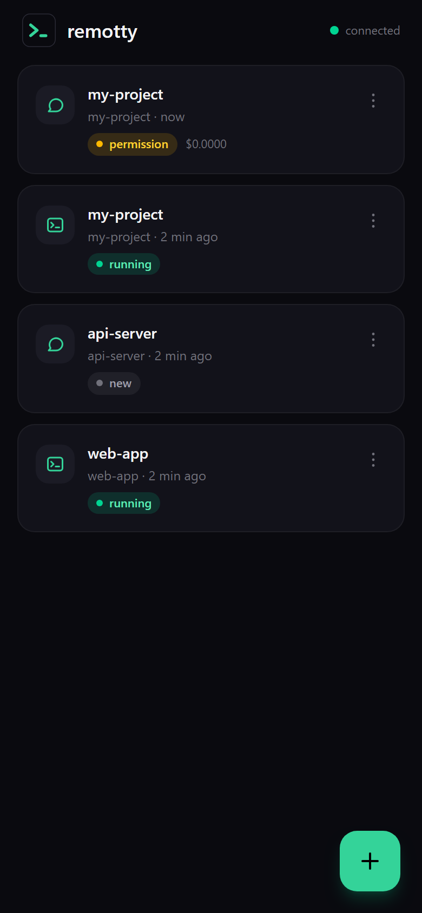
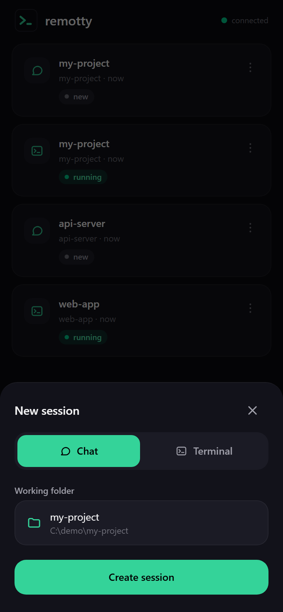
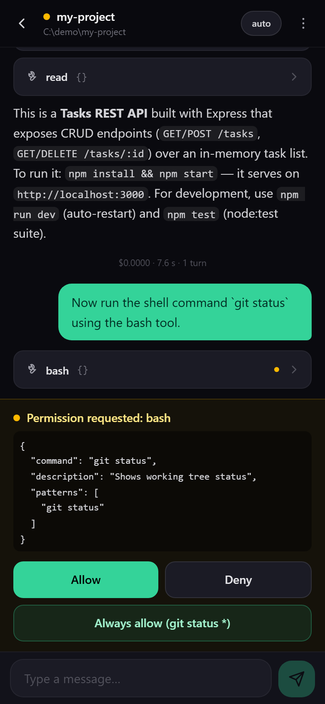
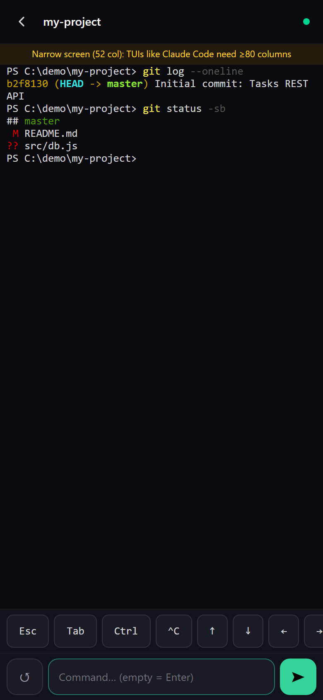

# remotty

<table align="center">
  <tr>
    <td align="center"><br /><sub><b>Home</b> · session list</sub></td>
    <td align="center"><br /><sub><b>New session</b> · Chat (OpenCode) or Terminal</sub></td>
  </tr>
  <tr>
    <td align="center"><br /><sub><b>Chat</b> · tool cards + permission prompt</sub></td>
    <td align="center"><br /><sub><b>Terminal</b> · xterm + extra-keys bar</sub></td>
  </tr>
</table>

Code from your phone. **remotty** is a self-hosted web app that runs on your dev machine and
wraps terminal coding agents in a mobile-first chat UI — powered by [OpenCode](https://opencode.ai)
— plus a folder browser and a real terminal (xterm over ConPTY/forkpty) as a fallback for
anything else (including other agent CLIs like `claude` or `codex`).

No API keys: bring your own agent login. OpenCode works out of the box with its free provider,
or with your existing subscriptions (`opencode auth login`).

- **Chat** — streaming responses, tool calls as collapsible cards, permission prompts as
  Allow / Deny / Always-allow sheets, model picker, context compact/clear.
- **Terminal** — full xterm with extra-keys bar (Esc, Tab, sticky Ctrl, arrows), replay buffer
  on reconnect. Run any TUI, including other coding agents.
- **Mobile-first PWA** — installable on the home screen (over HTTPS), wake lock while the agent
  runs, lossless reconnect after screen lock.
- **Self-hosted** — a single Node server on your machine; your code never leaves it.

Monorepo (npm workspaces): `shared/` (protocol contract), `server/` (Express + ws + OpenCode
adapter), `web/` (Vite + React + Tailwind, PWA).

## Requirements

- Node.js >= 20 (tested on Node 24, Windows 11 and macOS Apple Silicon)
- [OpenCode](https://opencode.ai) CLI for the chat: `npm install -g opencode-ai`
  (the terminal works without it)

## Install

```bash
npm install
```

> **Never use `npm install --omit=optional`**: it breaks the platform binaries of
> `@lydell/node-pty` (missing at require time). If you did: delete `node_modules`
> and reinstall without the flag.

## Build & run

```bash
npm run build
npm start
```

The production server serves the compiled web app (`web/dist`) by itself.

Environment variables:

| Variable | Default | Meaning |
|---|---|---|
| `PORT` | `7710` | HTTP/WS port |
| `HOST` | `0.0.0.0` | Bind address (use `127.0.0.1` behind Tailscale Serve) |
| `REMOTTY_AUTH_TOKEN` | _(empty = auth disabled!)_ | Token required at login, via cookie or `Authorization: Bearer` |
| `REMOTTY_DATA_DIR` | `<repo>/data` | Runtime state: `sessions.json`, chat JSONL logs |
| `REMOTTY_OPENCODE_PORT` | `7720` | Local port of the `opencode serve` spawned by the server |
| `REMOTTY_OPENCODE_MODEL` | _(OpenCode default)_ | Model for chats, `provider/model` format (e.g. `anthropic/claude-sonnet-4-6`) |

## Use it from your phone (LAN)

1. **Set `REMOTTY_AUTH_TOKEN`** — without it, anyone on your network can run commands on your
   machine:

   ```powershell
   # PowerShell
   $env:REMOTTY_AUTH_TOKEN = 'a-long-random-token'; npm start
   ```

   ```bash
   # bash/zsh
   REMOTTY_AUTH_TOKEN='a-long-random-token' npm start
   ```

2. Open `http://<your-pc-ip>:7710` from the phone (reachable IPs are printed at startup) and
   enter the token on the login screen.

Over plain HTTP the browser won't offer PWA install or a service worker; the app still works.
For the full experience see Tailscale below.

### Install on iPhone

iOS does not normally show an automatic PWA installation prompt. Open remotty over **HTTPS in
Safari**, tap **Share**, then choose **Add to Home Screen** (and enable **Open as Web App** if
shown). Opening the site inside another app's embedded browser may hide this option.

## Tailscale (recommended)

With Tailscale on both PC and phone you get valid HTTPS (installable PWA, reliable wake lock and
clipboard) without opening any ports:

```bash
# bind local only, then expose via Tailscale Serve
HOST=127.0.0.1 npm start
tailscale serve --bg --https=443 7710
```

The app becomes reachable at `https://<machine-name>.<tailnet>.ts.net` from any device on your
tailnet. Keep `REMOTTY_AUTH_TOKEN` set anyway.

## OpenCode chat

The server lazily spawns a single `opencode serve` on `127.0.0.1:7720` at the first message and
talks to it over HTTP + SSE; sessions are scoped per project folder.

- **No login needed** to start: the free `opencode` provider works immediately.
- To use **your own** models/subscriptions: run `opencode auth login` on the PC
  (e.g. Anthropic → Claude Pro/Max).
- **Model and reasoning picker in chat**: the header button lists every provider/model configured
  in OpenCode and the reasoning variants supported by the selected model (for example low, high
  or max). Both choices are persisted per session and can be changed mid-conversation. Model
  priority: in-chat choice → `REMOTTY_OPENCODE_MODEL` → OpenCode default.
- **Context controls** (chat ⋮ menu): *clear context* starts a fresh agent session under the
  hood (UI history stays), *compact context* summarizes the conversation to free context
  (like `/compact`).
- The `opencode serve` process is shut down together with the server.

## Development

```bash
npm run dev
```

Starts the server (`tsx watch`, port 7710) and the Vite dev server in parallel; Vite proxies
`/api` (HTTP + WS). End-to-end smoke test (no agent is ever started):

```bash
npm run build && node scripts/smoke.mjs
```

OpenCode adapter e2e smoke (requires `opencode` installed; uses the free provider, zero cost):

```bash
node scripts/smoke-opencode.mjs
```

## License

[MIT](LICENSE)
